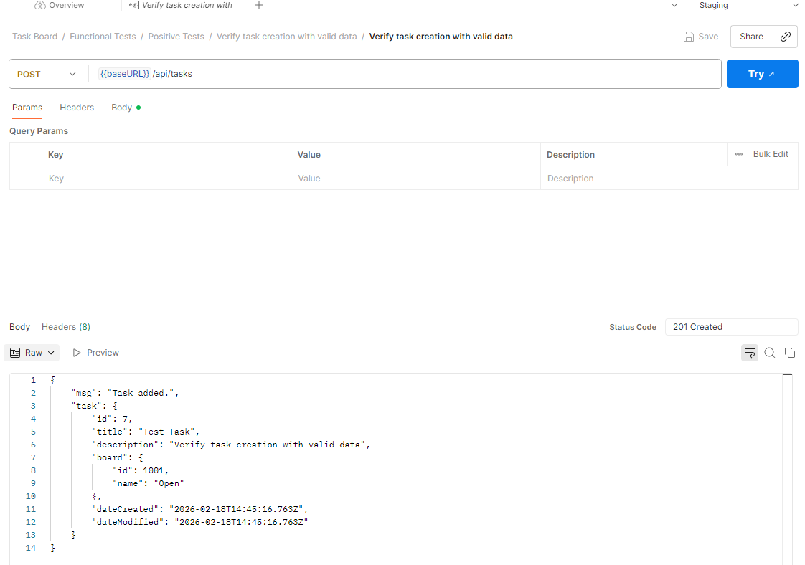
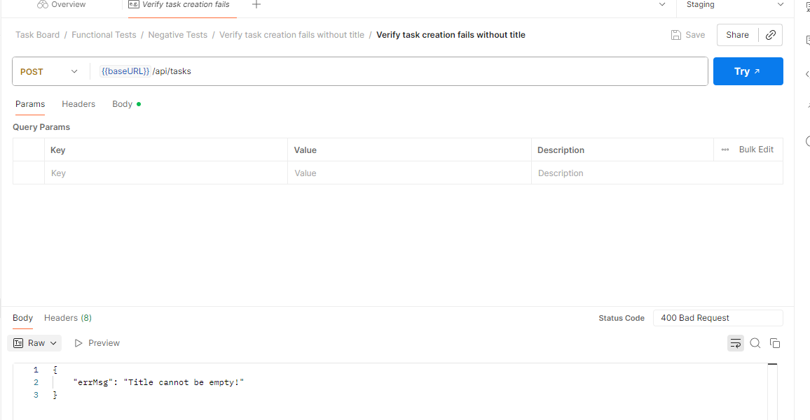
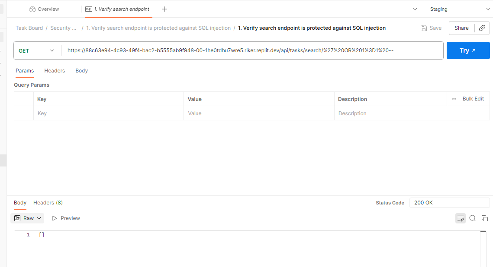

#  About TaskBoard API TestSuite

## Project Overview
TaskBoard is a project management application that allows users to create, update, move, and manage tasks across boards.  
This API TestSuite covers **functional, negative, and security tests**, providing a comprehensive overview of the application's behavior.

**Deployed Application:** [TaskBoard on Repl.it](https://replit.com/@StoevaGergana/TaskBoardV01#index.js)

---

## Test Coverage

### Functional Tests

#### Positive Tests
| Request | Description | Expected Result |
|---------|-------------|----------------|
| GET | Verify API base route returns available endpoints | 200 OK |
| GET | Verify GET /api/boards returns all boards | 200 OK |
| GET | Verify GET /api/tasks returns all tasks | 200 OK |
| GET | Verify GET /api/tasks/:id returns correct task | 200 OK |
| GET | Verify task search by keyword returns matching tasks | 200 OK |
| GET | Verify tasks filtered by board name | 200 OK |
| GET | Verify search endpoint responds within acceptable time | 200 OK / acceptable response time |
| POST | Verify task creation with valid data | 201 Created |
| POST | Create Task | 201 Created |
| POST | Create Task 2 | 201 Created |
| PATCH | Verify task update with valid data | 200 OK |
| PATCH | Verify task can be moved between valid boards | 200 OK |
| DEL | Verify task deletion with valid ID | 200 OK |

#### Negative Tests
| Request | Description | Expected Result |
|---------|-------------|----------------|
| GET | Verify API response for non-existing task ID | 404 Not Found |
| GET | Verify task search with non-existing keyword | 200 OK (empty result) |
| GET | Verify search endpoint handles excessively long input safely | 400 Bad Request |
| GET | Verify filtering by invalid board | 400 Bad Request |
| GET | Verify API handles rapid repeated requests safely | 429 Too Many Requests / safe handling |
| POST | Verify task creation fails without title | 400 Bad Request |
| PATCH | Verify task update with invalid ID fails | 404 Not Found |
| PATCH | Verify task can be moved between invalid boards | 400 Bad Request |
| PUT | Verify API rejects unsupported HTTP methods | 405 Method Not Allowed |
| DEL | Verify task deletion with invalid ID | 404 Not Found |

### Security Tests
| Request | Description | Expected Result |
|---------|-------------|----------------|
| GET | Verify search endpoint handles special characters safely | 200 OK |
| GET | Verify search endpoint is protected against SQL injection | 400/secure response |
| GET | Verify search endpoint safely handles script injection payload | 400/secure response |
| GET | API response headers should not expose sensitive information | 200 OK / secure headers |
| POST | Verify API handles duplicate requests safely | 200 OK / idempotent handling |
| POST | Verify API handles malformed JSON safely | 400 Bad Request |
| PATCH | Verify data manipulation endpoints reject unsupported HTTP requests | 405 Method Not Allowed |

---

## Folder Structure in Postman

📁 Functional Tests: 📁 Positive Tests 📁 Negative Tests

📁 Security Tests

## Screenshots

### ✅ Create Task - Success (201 Created)
This test verifies that the API successfully creates a new task when valid data is provided and returns the correct status code and response body.

### ❌ Create Task - Missing Title (400 Bad Request)
This test verifies that the API correctly validates required fields and returns an error when the title is missing.

### 🔐 SQL Injection Test
This test verifies that the API is protected against SQL injection attacks and properly handles malicious input without exposing or compromising data.

